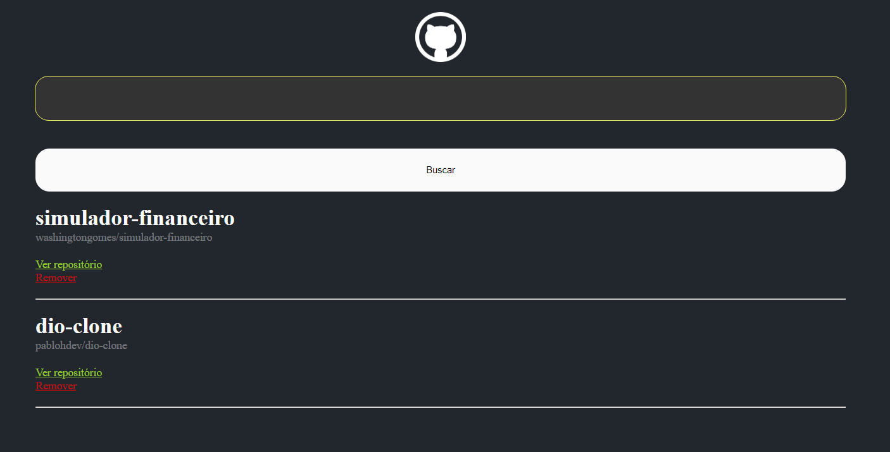

# Triha Orange Tech - Dio
    > Desafio 02 - Wiki

#  Tecnologias
    > HTML 
    > css
    > Git & GitHub
    > JavaScript

    Professor: Pablo Henrique

[Clique aqui para acessar o site](https://washingtongomes.github.io/)

 Orientação para criar projeto em React
 [React](https://github.com/facebook/create-react-app)

Iniciando projeto:
Comandos: 
### `npm start`
### `npm test`
### `npm run build`
### `npm run eject`
### `npm run build` 
